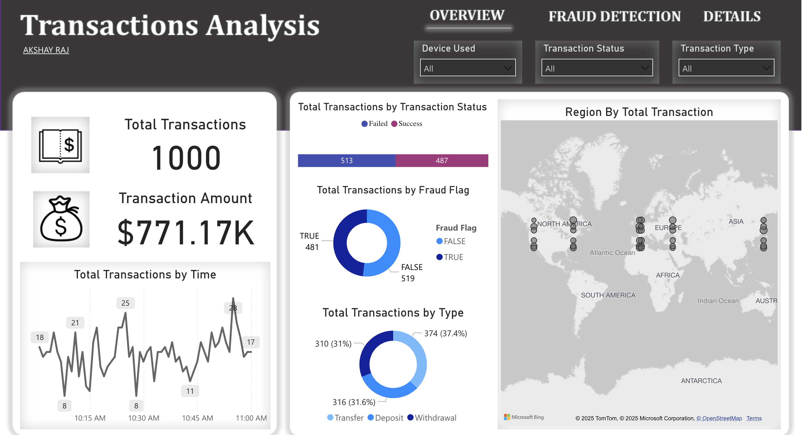

# 💳 Transactional History Dashboard & Analysis

## 📌 Project Overview
In the digital banking era, **fraud detection, transaction monitoring, and financial analytics** play a crucial role in securing users and preventing financial losses. The **Transactional History Dashboard & Analysis** provides a **comprehensive, data-driven approach** to understanding **transaction trends, fraud detection, and customer behavior**.

This project **leverages SQL and dashboard visualizations** to uncover **key financial insights, detect anomalies, and enhance decision-making** in a banking environment.

---

## 🔗 Live Dashboard Link
## [**View Live Dashboard Here**](https://app.powerbi.com/view?r=eyJrIjoiMWMwNTVkMjYtNTg3OC00ZTZiLWFmYmMtYTk3NTAyYjQzNjM0IiwidCI6ImRhMDRjZDQxLTk4ZGUtNDU4YS05Zjg5LTUzNWFjODI0MWJmOSIsImMiOjJ9&pageName=998eb3480ce7783be6b5)

 <!-- Replace with actual image path -->

## 🚀 Key Business Problems Addressed

### **1️⃣ High Transaction Volume & Processing Efficiency ⚡**
- With **1000+ transactions processed**, monitoring **real-time transaction trends** is crucial for optimizing **banking operations**.
- Identifying **peak transaction times** allows banks to **allocate resources effectively**.

### **2️⃣ Fraud Detection & Risk Mitigation 🚨**
- **Fraudulent transactions** cost businesses millions of dollars annually.
- This project **analyzes fraud trends**, **detects high-risk regions**, and identifies **high-frequency fraudulent accounts**.

### **3️⃣ Transaction Success vs. Failure Analysis ❌✅**
- **Why do transactions fail?** Are there patterns in **failed vs. successful transactions**?
- Understanding transaction failures **helps optimize banking infrastructure** and **improve customer experience**.

### **4️⃣ Customer Behavior Analysis 🏦**
- Which customers **transact the most**? Who are the **repeat customers**?
- Identifying **customer spending patterns** helps **banks optimize services and personalize offerings**.

### **5️⃣ Device & Network Impact on Transactions 📡📱**
- Does **fraud occur more on mobile devices than desktops?**
- Which **network slices** show **higher fraud rates**? 
- Analyzing **transaction patterns by device and network** can enhance **security measures**.

### **6️⃣ High-Value Transaction Monitoring 💰**
- Some transactions **exceed standard thresholds**, raising red flags.
- Identifying **high-value transactions** and **unusual withdrawal-to-deposit ratios** is essential for **compliance & risk assessment**.

---

## 🛠️ Tech Stack Used

### **📊 Data Visualization & Reporting**
- **Power BI / Tableau** – **Interactive dashboard** showcasing **transaction trends, fraud detection, and financial insights**.
- **Excel & CSV Processing** – **Data transformation and preparation** before SQL ingestion.

### **💾 Database & Query Processing**
- **PostgreSQL / MySQL / SQL Server** – **Relational database for structured financial data storage**.
- **SQL Queries** – Used for **data aggregation, fraud detection, anomaly detection, and performance analysis**.

### **📜 SQL Features Used**
- **Joins & Subqueries** – Merging multiple tables for **complex insights**.
- **Aggregations (SUM, COUNT, AVG, etc.)** – For calculating **total transactions, average amounts, and fraud rates**.
- **Window Functions (RANK, PARTITION BY, LAG)** – Identifying **trends, ranking high-risk accounts, and fraud pattern analysis**.
- **Date & Time Functions** – **Extracting trends based on transaction hours, days, and months**.
- **Filtering & Grouping** – Categorizing **transactions for granular analysis**.

--- 

### **Dashboard Features**
✅ **Total Transactions Processed**: **1000+**  
✅ **Total Transaction Volume**: **$771.17K**  
✅ **Fraud Transactions Identified**: **481 ($378.86K value)**  
✅ **Transaction Success Rate**: **~49% Success, 51% Failed**  
✅ **Top Transaction Types**: **Transfers (37.4%), Deposits (31.6%), Withdrawals (31%)**  
✅ **Peak Transaction Hours**: **Between 10 AM - 2 PM**  
✅ **High-Risk Network Slices Identified** 🚨  
✅ **Device-Based Transaction Insights** 📱💻  

---

## 📂 SQL Files in This Project

### **1️⃣ EDA.sql – Exploratory Data Analysis 🔍**
📌 **Analyzes transaction trends, fraud rates, and transaction statuses**.  
📌 **Identifies peak hours and busiest transaction days**.  
📌 **Finds success vs. failure rate of transactions**.  

### **2️⃣ Summary_Stats.sql – Transaction & Fraud Statistics 📊**
📌 **Calculates average, median, and standard deviation of transaction amounts**.  
📌 **Analyzes SLA compliance and fraud percentages**.  
📌 **Breaks down transactions by type, region, and device**.  

### **3️⃣ Advanced_Analysis.sql – Trend & Pattern Recognition 📈**
📌 **Identifies high-fraud network slices**.  
📌 **Analyzes fraud percentage per transaction type and device used**.  
📌 **Detects regions with the highest fraud rates**.  

### **4️⃣ Business_Problems.sql – Real-World Use Cases & Solutions 💡**
📌 **Detects high-risk accounts with frequent fraud transactions**.  
📌 **Identifies regions where fraud is increasing over time**.  
📌 **Analyzes failed transactions and SLA breaches**.  

### **5️⃣ Anomaly_Detection.sql – Fraud & Risk Analysis 🚨**
📌 **Detects suspiciously high-value transactions**.  
📌 **Finds accounts with excessive failed transaction attempts**.  
📌 **Identifies transactions happening outside normal business hours**.  

---

## 📈 Key Insights from SQL Analysis

🔍 **Fraud accounts for ~48.1% of total transactions**, with an impact of **$378.86K**.  
🔍 **Transfers have the highest fraud rates**, making up **35.34% of fraud cases**.  
🔍 **Transaction failures are most common between 10:15 AM and 11:00 AM**.  
🔍 **Fraud is more frequent on desktop devices compared to mobile transactions**.  
🔍 **High-value withdrawals exceed deposits in 20% of flagged accounts**.  
🔍 **Certain network slices have 2x higher fraud rates than others**.  

---

## 📝 Future Improvements

🚀 **Predictive Modeling for Fraud Detection**  
📊 **AI-based Anomaly Detection for Financial Transactions**  
⚡ **Real-Time Monitoring & Alerts for High-Risk Transactions**  
🔍 **Sentiment Analysis on Customer Complaints & Transaction Issues**  
💡 **Machine Learning to Flag Suspicious User Behavior**  

---

## 🎯 Conclusion

The **Transactional History Dashboard & Analysis** is a **data-driven solution** for understanding **banking transactions, fraud detection, and financial performance**. 

This project **utilizes SQL analytics & visualization tools** to deliver **valuable financial insights, detect anomalies, and improve banking operations**.

By leveraging **SQL expertise**, **real-world business intelligence**, and **visual dashboards**, this project enables **banks, financial analysts, and fraud detection teams** to **make informed decisions and enhance security measures**.  

---

